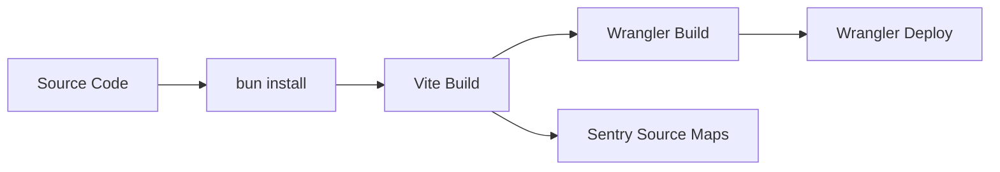
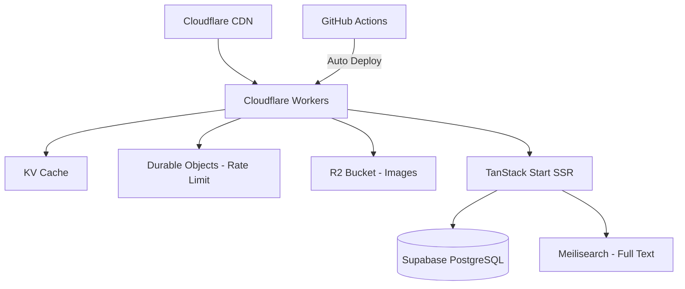

# AgendaPrestasi — System Documentation

> **Platform pencarian beasiswa, kompetisi, dan event terbaru untuk pelajar dan mahasiswa Indonesia.**  
> Dibangun dengan TanStack Start (React SSR) di atas Cloudflare Workers dengan backend Supabase.

---

## Table of Contents

1. [System Design](#1-system-design)
2. [System Architecture](#2-system-architecture)
3. [Frontend](#3-frontend)
4. [APIs & Backend Logic](#4-apis--backend-logic)
5. [Databases & Storage](#5-databases--storage)
6. [Auth & Permissions](#6-auth--permissions)
7. [Hosting & Cloud](#7-hosting--cloud)
8. [CI/CD & Version Control](#8-cicd--version-control)
9. [Security](#9-security)
10. [Rate Limiting](#10-rate-limiting)
11. [Caching & CDN](#11-caching--cdn)
12. [Error Tracking & Logs](#12-error-tracking--logs)
13. [Monitoring & Alerts](#13-monitoring--alerts)
14. [Testing](#14-testing)
15. [Scaling](#15-scaling)
16. [Appendices](#16-appendices)

---

## 1. System Design

### Overview

AgendaPrestasi is a **content publishing platform** focused on aggregating and displaying scholarships, competitions, and events for Indonesian students. It follows a **Jamstack-like architecture** with server-side rendering (SSR) at the edge.

### Design Principles

- **Edge-first**: Render and serve from Cloudflare's global network (200+ locations)
- **Zero cold starts**: Cloudflare Workers spin up in microseconds
- **Content-centric**: Database schema optimized for content queries with composite indexes
- **Progressive enhancement**: Core content available without JavaScript; interactivity layered on top
- **Optimistic UI**: Bookmark mutations update the UI immediately, rollback on error

### Data Flow

```
                         ┌──────────────────────────┐
                         │     Cloudflare Worker     │
                         │  (Edge — 200+ locations)  │
                         │                           │
  Browser ───Request──▶  │  ┌─ Rate Limit Check ──┐  │
                         │  │   (60 req/min per IP) │  │
                         │  └──────┬───────────────┘  │
                         │         ▼                  │
                         │  ┌─ KV Cache Check ────┐  │
                         │  │  (Cache hit → return) │  │
                         │  └──────┬───────────────┘  │
                         │         ▼ (cache miss)     │
                         │  ┌─ SSR (TanStack Start)   │
                         │  │  → React renders on edge │
                         │  └──────┬───────────────┘  │
                         └─────────┼─────────────────┘
                                   │
                         ┌─────────▼─────────────────┐
                         │       Supabase             │
                         │  ┌──────────────────────┐  │
                         │  │  PostgreSQL Database  │  │
                         │  │  - posts              │  │
                         │  │  - user_roles         │  │
                         │  │  - bookmarks          │  │
                         │  │  - app_settings       │  │
                         │  └──────────────────────┘  │
                         │  ┌──────────────────────┐  │
                         │  │  Auth (Google OAuth)  │  │
                         │  └──────────────────────┘  │
                         │  ┌──────────────────────┐  │
                         │  │  Storage (post-images)│  │
                         │  └──────────────────────┘  │
                         └────────────────────────────┘
```

---

## 2. System Architecture

### Layer Map

| Layer | Technology | Responsibility |
|-------|-----------|----------------|
| **Edge Worker** | Cloudflare Workers | Entry point, rate limiting, KV caching, request routing |
| **SSR Framework** | TanStack Start | Server-side rendering, file-based routing, API handlers |
| **Client Framework** | React 19 + TanStack Router | UI rendering, client-side navigation, state management |
| **Backend Services** | Supabase | Database (PostgreSQL), Auth (Google OAuth), Storage, RLS |
| **Monitoring** | Sentry + PostHog | Error tracking, performance monitoring, product analytics |

### Component Diagram

```
┌──────────────────────────────────────────────────────────────────┐
│                    Cloudflare Worker (worker.ts)                   │
│                                                                   │
│  ┌──────────────────────────────────────────────────────────┐     │
│  │  @sentry/cloudflare wrapper — global error capture       │     │
│  └──────────────────────────────────────────────────────────┘     │
│                                                                   │
│  ┌──────────────────┐  ┌────────────────────┐  ┌──────────────┐  │
│  │  Rate Limiter     │  │  KV Cache Handler  │  │  SSR Proxy   │  │
│  │  (in-memory Map)  │  │  (GET /api/posts)  │  │  → server    │  │
│  └──────────────────┘  └────────────────────┘  └──────────────┘  │
│                                                                   │
│  ┌──────────────────────────────────────────────────────────┐     │
│  │  Cache Populator (post-request, ctx.waitUntil)           │     │
│  └──────────────────────────────────────────────────────────┘     │
└──────────────────────────────────────────────────────────────────┘

┌──────────────────────────────────────────────────────────────────┐
│                  TanStack Start SSR Server                        │
│                                                                   │
│  ┌──────────────────────────────────────────────────────────┐     │
│  │  Backend Layer                                            │     │
│  │  ┌────────────┐  ┌────────────┐  ┌──────────────────┐    │     │
│  │  │ auth/      │  │ queries/   │  │ supabase/        │    │     │
│  │  │ - auth.ts  │  │ - posts.ts │  │ - client.ts      │    │     │
│  │  │ - perms.ts │  │            │  │ - client.server.ts│    │     │
│  │  │ - middleware│  │            │  │ - auth-middleware │    │     │
│  │  └────────────┘  └────────────┘  └──────────────────┘    │     │
│  └──────────────────────────────────────────────────────────┘     │
│                                                                   │
│  ┌──────────────────────────────────────────────────────────┐     │
│  │  Routes (file-based)                                      │     │
│  │  __root → index → login → auth.callback → calendar       │     │
│  │  → posts.$slug → profile → admin → admin.*               │     │
│  └──────────────────────────────────────────────────────────┘     │
│                                                                   │
│  ┌──────────────────────────────────────────────────────────┐     │
│  │  Frontend Components (React)                             │     │
│  │  Navbar, PostCard, PostForm, BookmarkButton, StatusBadge │     │
│  │  Calendar (MonthlyListSection, MonthlyListItem)          │     │
│  │  shadcn/ui (~40 components)                             │     │
│  └──────────────────────────────────────────────────────────┘     │
└──────────────────────────────────────────────────────────────────┘

┌──────────────────────────────────────────────────────────────────┐
│                    Third-Party Services                           │
│                                                                   │
│  Supabase Cloud      │  Sentry             │  PostHog            │
│  ┌────────────────┐  │  ┌───────────────┐  │  ┌───────────────┐  │
│  │ PostgreSQL DB  │  │  │ Error Tracking│  │  │ Analytics     │  │
│  │ Auth (Google)  │  │  │ Source Maps   │  │  │ Session Rec.  │  │
│  │ Storage        │  │  │ Replay        │  │  │ Feature Flags │  │
│  └────────────────┘  │  └───────────────┘  │  └───────────────┘  │
└──────────────────────────────────────────────────────────────────┘
```

---

## 3. Frontend

### Tech Stack

| Technology | Purpose | Version |
|-----------|---------|---------|
| React | UI library | 19.2.0 |
| TanStack Router | File-based routing, type-safe navigation | 1.168.0 |
| TanStack Start | SSR framework (Vite plugin) | 1.167.14 |
| TanStack Query | Server state, caching, mutations | 5.83.0 |
| Tailwind CSS v4 | Utility-first CSS | 4.2.1 |
| shadcn/ui | UI component library (Radix primitives) | — |
| Lucide React | Icons | 0.575.0 |
| date-fns | Date formatting (Indonesian locale) | 4.1.0 |
| DOMPurify | HTML sanitization | 3.4.5 |
| React Hook Form + Zod | Form handling & validation | 7.71.2 + 3.24.2 |
| Recharts | Charts | 2.15.4 |
| KaTeX | LaTeX rendering | 0.16.45 |
| sonner | Toast notifications | 2.0.7 |

### Route Map

| Path | Component | Auth Required | Description |
|------|-----------|---------------|-------------|
| `/` | HomePage | No | Landing page with post feed, search, filter, pagination |
| `/login` | LoginPage | No (redirects if logged in) | Google OAuth login |
| `/auth/callback` | (auth callback) | No | OAuth redirect handler |
| `/calendar` | CalendarPage | Yes | Interactive monthly calendar with deadlines |
| `/posts/$slug` | PostDetailPage | No | Post detail with content, status badges, bookmark |
| `/profile` | ProfilePage | Yes | User profile & bookmarks |
| `/admin` | AdminLayout | Yes (admin+) | Admin dashboard layout |
| `/admin/` | AdminPostsPage | Yes (admin+) | Post management table |
| `/admin/posts/new` | NewPostPage | Yes (admin+) | Create new post |
| `/admin/posts/$id/edit` | EditPostPage | Yes (admin+) | Edit existing post |

### Key UI Patterns

- **PostCard**: Card component with category badge, deadline status, bookmark toggle, and responsive grid layout (1/2/3 columns)
- **PostCardSkeleton**: Loading skeleton matching PostCard dimensions (prevents layout shift)
- **StatusBadge**: Color-coded badge — "Akan Datang" (upcoming), "Berlangsung" (active), "Telah Berakhir" (closed)
- **Deadline badges**: Color-coded by urgency — green (>30 days), yellow (7–30 days), red (≤7 days)
- **Calendar**: Interactive month grid with category dots (mobile) or text pills (desktop), event modals/bottom sheets
- **Navbar**: Sticky top bar with role-aware menu, mobile drawer, user dropdown
- **Error Boundary**: Sentry-wrapped with custom "Coba Lagi" button (Indonesian language)
- **404 Page**: Custom not-found with Indonesian text
- **Loading states**: Every data-fetching route has skeleton/spinner + empty + error states

### State Management

- **Server state**: TanStack Query with configurable `staleTime` and `gcTime`
  - Posts list: 3 min stale, 10 min gc
  - Post detail: 5 min stale, 15 min gc
  - Bookmarks: 2 min stale, 10 min gc
  - Calendar: 5 min stale, 15 min gc
  - User role: 10 min stale, 30 min gc
- **UI state**: React `useState`/`useReducer` for modals, filters, mobile menu
- **Auth state**: React Context (`AuthProvider`) with Supabase session + custom role

### Mobile Responsiveness

- Breakpoints: sm (640px), md (768px), lg (1024px)
- Calendar: dots on mobile, text pills on desktop; bottom sheet on <640px, modal on ≥640px
- Admin table: responsive with hidden columns on smaller screens
- Navbar: sticky with hamburger menu on mobile, horizontal links on desktop
- Post grid: 1 column mobile, 2 tablet, 3 desktop

### SEO & Metadata

- Per-route `<head>` meta tags via TanStack Router's `head` option
- Open Graph tags (title, description, image) for social sharing
- Twitter card (summary_large_image)
- PWA-ready: `site.webmanifest`, favicons, apple-touch-icon
- Semantic HTML with `lang="id"`

---

## 4. APIs & Backend Logic

### Worker Entry Point (`worker.ts`)

The Cloudflare Worker acts as a smart proxy. It does not contain business logic beyond rate limiting, caching, and security headers.

**Flow:**
1. Wrap with `Sentry.withSentry()` for error capture
2. Check rate limit (skip if `DISABLE_RATE_LIMIT=1`)
3. Check KV cache for GET `/api/posts`
4. Forward to TanStack Start SSR server
5. On 200 response, populate KV cache asynchronously (`ctx.waitUntil`)
6. Attach rate limit headers to response

### Server Queries (`src/backend/queries/posts.ts`)

All Supabase queries live in one file, separated by access level:

**Public Queries:**
- `fetchPublishedPosts(category?, search?, tags?, page, limit)` — paginated feed with filters
  - Query: `.select(LIST_COLUMNS, { count: "exact" }).eq("status", "published").order("created_at", { ascending: false }).range(from, to)`
  - Search uses postgres `ilike` on title and description
  - Tags use `contains` operator (PostgreSQL array overlap)
  - Returns: `{ posts, total, page, limit, totalPages }`
- `fetchPostBySlug(slug)` — single post detail

**Admin Queries (all guarded by `requireAdmin`):**
- `fetchAllPosts(userId)` — all posts (no pagination)
- `createPost(post, userId)` — insert with author_id
- `updatePost(id, post, userId)` — update by ID
- `deletePost(id, userId)` — delete by ID
- `togglePostStatus(id, currentStatus, userId)` — toggle draft/published

### Cache Invalidation API

- **Endpoint**: `POST /api/cache/invalidate`
- **Auth**: `x-cache-secret` header matching `CACHE_INVALIDATE_SECRET` env var
- **Action**: Bulk deletes 20 KV keys (5 categories × 4 pages) for common cache entries
- **Response**: `{ success: true, cleared: 20 }`

### Middleware

**Auth Middleware** (`src/backend/supabase/auth-middleware.ts`):
- TanStack Start `createMiddleware` function
- Extracts Bearer token from Authorization header
- Creates a Supabase client with the token
- Verifies JWT claims via `supabase.auth.getClaims(token)`
- Passes `{ supabase, userId, claims }` to next handler

**Admin Middleware** (`src/backend/auth/admin-middleware.ts`):
- `requireAdmin(userId)` — fetches user role from `user_roles` table
- Throws `"Access Denied: Admin role required"` if not admin/super_admin
- Used as a guard in all admin query functions

---

## 5. Databases & Storage

### Primary Database: Supabase (PostgreSQL)

#### Tables

| Table | Purpose | Key Columns | RLS |
|-------|---------|-------------|-----|
| `posts` | Core content (scholarships, competitions, events) | `id (UUID PK)`, `title`, `slug (UNIQUE)`, `category`, `tags (TEXT[])`, `status`, `content`, `deadline`, `open_date`, `announcement_date`, `link`, `author_id` | ✅ Public read (published only), admin CRUD by role |
| `user_roles` | Admin role assignment | `id (UUID PK)`, `user_id (UNIQUE)`, `role (TEXT)`, `email` | ✅ Limited |
| `bookmarks` | User post bookmarks | `id (UUID PK)`, `user_id`, `post_id (FK → posts.id)` | ✅ User owns their bookmarks |
| `app_settings` | Key-value settings | `key (PK)`, `value` | — |

#### Indexes (from migration)

- Composite: `(status, category, created_at DESC)` — feed queries
- GIN: `tags` — array contains queries
- GIN: `to_tsvector('indonesian', title || ' ' || COALESCE(description, ''))` — full-text search
- B-tree: `author_id`, `created_at`

#### Row-Level Security (RLS) Policies

**posts:**
- `SELECT`: published posts for public; all posts for admin/super_admin
- `INSERT`: authenticated users with admin role
- `UPDATE`: own posts (admin) or any post (super_admin)
- `DELETE`: own posts (admin) or any post (super_admin)

**bookmarks:**
- `SELECT`: own bookmarks only
- `INSERT`: own bookmarks only
- `DELETE`: own bookmarks only

**user_roles:**
- `SELECT`: own role only (public); all for super_admin
- `INSERT/UPDATE/DELETE`: super_admin only

### Storage: Supabase Storage

- **Bucket**: `post-images`
- **Access**: Public read, authenticated write
- **Purpose**: Store post-related images (currently unused — `image_url` removed from posts)

### Database Functions

- `has_user_role(_roles TEXT[], _user_id TEXT)` — check if user has any of the given roles
- `is_admin()` — convenience function checking current user's admin status

### Connection Architecture

```typescript
// Client-side (browser) — anon key, RLS enforced
import { supabase } from "@backend/supabase/client";
// Uses VITE_SUPABASE_URL + VITE_SUPABASE_ANON_KEY
// Auth: persistSession + autoRefreshToken enabled

// Server-side (SSR) — service role key, bypasses RLS
import { supabaseAdmin } from "@backend/supabase/client.server";
// Uses SUPABASE_URL + SUPABASE_SERVICE_ROLE_KEY
// Auth: no persistence, no auto-refresh
// SECURITY: only for trusted server operations

// Server-side (authenticated) — user's JWT token
// Created in auth-middleware.ts with Bearer token
// RLS enforced based on user's claims
```

---

## 6. Auth & Permissions

### Authentication Flow

```
User clicks "Masuk"
       │
       ▼
  Login Page (/login)
       │
       ▼
  Supabase Auth: signInWithOAuth({ provider: "google" })
       │
       ▼
  Google OAuth consent screen
       │
       ▼
  Redirect to /auth/callback
       │
       ▼
  Supabase session established
       │
       ▼
  AuthProvider detects session → fetches user role
       │
       ▼
  App renders with user context
```

### Auth Provider (`use-auth.tsx`)

- React Context wrapping the entire app
- Initializes on mount: `supabase.auth.getSession()`
- Listens to `onAuthStateChange` for real-time session updates
- Re-syncs session on `visibilitychange` (tab refocus)
- 5-second safety timeout to prevent infinite loading
- Identifies user in PostHog and Sentry on session change
- Exposes: `{ user, session, role, isAdmin, isSuperAdmin, loading, isAuthenticated }`

### Role System

| Role | Database Access | Application Access |
|------|----------------|--------------------|
| `public` (unauthenticated) | Read published posts | Browse posts, view calendar (redirect to login) |
| `public` (authenticated) | Read published posts, manage own bookmarks | All public + bookmark + profile |
| `admin` | Insert posts, update/delete own posts | All public + admin dashboard + manage own posts |
| `super_admin` | Full CRUD all posts, manage `user_roles` | All admin + manage any post + manage roles |

### Permission Helpers (`permissions.ts`)

```typescript
can.accessAdmin(role)          // role === "admin" || "super_admin"
can.editPost(role, authorId, currentUserId)
can.deletePost(role, authorId, currentUserId)
can.publishPost(role, authorId, currentUserId)
can.manageRoles(role)          // role === "super_admin" only
```

### Security Layers

1. **Supabase RLS** — database-level row restrictions
2. **Admin middleware** (`requireAdmin`) — server-side guard before any admin query
3. **Client-side permissions** (`can.*`) — UI-level action visibility
4. **Session validation** — server verifies Bearer token JWT claims via `supabase.auth.getClaims()`

### Admin Management

- Add admin: `INSERT INTO user_roles (user_id, email, role) VALUES ('...', '...', 'admin');`
- Remove admin: `DELETE FROM user_roles WHERE user_id = '...';`
- Upgrade to super_admin: `UPDATE user_roles SET role = 'super_admin' WHERE user_id = '...';`
- See: `docs/admin-management.sql`

---

## 7. Hosting & Cloud

### Cloudflare Workers

| Property | Value |
|----------|-------|
| **Runtime** | Cloudflare Workers (global edge network) |
| **Worker Name** | `app` |
| **Compatibility Date** | 2025-09-24 |
| **Compatibility Flags** | `nodejs_compat` |
| **Entry Point** | `./worker.ts` |
| **Static Assets** | `./dist/client` (via `@cloudflare/vite-plugin`) |
| **KV Namespace** | `POSTS_CACHE` (ID: `7df0025f9f6f4ccfb5900a4a3cab214f`) |

### Supabase (Cloud)

| Service | Purpose |
|---------|---------|
| **PostgreSQL Database** | All application data |
| **Auth** | Google OAuth, session management |
| **Storage** | Post images (bucket: `post-images`) |
| **Project ID** | `vofyrxnytkcbzuyrvjgn` |

### Environment Variables

| Variable | Scope | Purpose |
|----------|-------|---------|
| `VITE_SUPABASE_URL` | Client + Server | Supabase project URL |
| `VITE_SUPABASE_ANON_KEY` | Client + Server | Supabase anonymous key |
| `SUPABASE_URL` | Server only | Supabase project URL (server) |
| `SUPABASE_SERVICE_ROLE_KEY` | Server only | Service role key (admin operations) |
| `SUPABASE_PUBLISHABLE_KEY` | Server only | Publishable key (auth middleware) |
| `VITE_SENTRY_DSN` | Client + Build | Sentry Data Source Name |
| `VITE_SENTRY_SAMPLE_RATE` | Client | Traces sample rate (0.0–1.0) |
| `VITE_SENTRY_REPLAY_SAMPLE_RATE` | Client | Session replay sample rate |
| `SENTRY_AUTH_TOKEN` | Build only | Sentry source map upload token |
| `SENTRY_ORG` | Build only | Sentry organization name |
| `SENTRY_PROJECT` | Build only | Sentry project name |
| `VITE_PUBLIC_POSTHOG_KEY` | Client | PostHog API key |
| `VITE_PUBLIC_POSTHOG_HOST` | Client | PostHog ingestion host |
| `SENTRY_DSN` | Worker | Sentry DSN for Worker runtime |
| `ENVIRONMENT` | Worker | Environment label (e.g., "production") |
| `CACHE_INVALIDATE_SECRET` | Worker | Secret for cache invalidation endpoint |
| `DISABLE_RATE_LIMIT` | Worker | Bypass rate limiting (local testing) |

### Domain & DNS

- Managed via Cloudflare (DNS, CDN, SSL)
- Worker runs on Cloudflare's `*.workers.dev` subdomain or custom domain

---

## 8. CI/CD & Version Control

### Version Control

| Tool | Details |
|------|---------|
| **Git Host** | GitHub (via `gh` CLI available) |
| **Default Branch** | `main` |
| **Branch Strategy** | Feature branches → PR → `main` |

### Build Process



**Build steps (manual, via shell scripts):**
1. `rm -rf dist/ .wrangler/` — clean
2. `npm run build` — Vite builds client + server bundles with Sentry source map upload
3. `npx wrangler build` — Wrangler bundles worker.ts + server into deployable artifact
4. `npx wrangler deploy` — Uploads to Cloudflare Workers

### Deployment Scripts

| Script | Command | Description |
|--------|---------|-------------|
| `deploy.sh` | `./deploy.sh` | Full clean → build → deploy pipeline |
| `build.sh` | `./build.sh` | Build only (no deploy), for verification |

### CI Caveats

- **No automated CI pipeline** currently configured
- Deployments are manual via shell scripts
- Sentry source maps uploaded during `vite build` via `@sentry/vite-plugin`
- Environment variables must be set in Cloudflare Dashboard or via `wrangler secret`

---

## 9. Security

### Defense Layers (Defense in Depth)

| Layer | Mechanism | Bypassed By |
|-------|-----------|-------------|
| 1. Network | Cloudflare DDoS protection, WAF | — |
| 2. Edge | Rate limiting (60 req/min/IP) | Internal IPs, DISABLE_RATE_LIMIT flag |
| 3. Application | Auth middleware (JWT validation) | Valid session token |
| 4. Application | Admin middleware (`requireAdmin`) | Valid admin role in DB |
| 5. Database | Row-Level Security (RLS) | Service role key (server only) |
| 6. Client | Permission helpers (`can.*`) | UI-level, not security boundary |
| 7. Content | DOMPurify HTML sanitization | Trusted admin content (XSS prevention) |

### Security Measures Checklist

- ✅ **No secrets in frontend**: Only anon key exposed to client; service role key server-only
- ✅ **JWT validation**: Server-side token verification via `supabase.auth.getClaims()`
- ✅ **RLS on all tables**: Database-level row restrictions
- ✅ **Dual auth guards**: Server `requireAdmin()` + client `can.*` helpers
- ✅ **HTML sanitization**: DOMPurify with whitelist of allowed tags/attributes
- ✅ **Rate limiting**: 60 requests/minute per IP
- ✅ **Cache invalidation protected**: Secret header required
- ✅ **Sentry error filtering**: Ignores noisy browser errors (ResizeObserver loop)
- ✅ **PostHog input masking**: Password fields masked in session recordings
- ✅ **CORS**: No issues — SSR + Worker on same domain
- ✅ **Dependencies**: Regular updates via `bun install`/`npm run lint`

### Potential Improvements

- CSP (Content Security Policy) headers
- CSRF protection for mutations
- Rate limiting on auth endpoints specifically
- Automated dependency vulnerability scanning (Dependabot)

---

## 10. Rate Limiting

### Implementation (`worker.ts`)

```typescript
const RATE_LIMIT_WINDOW_MS = 60_000;  // 1 minute window
const RATE_LIMIT_MAX = 60;            // 60 requests per window
```

### Mechanism

- **Storage**: In-memory `Map<string, { count, start }>` (per-worker instance)
- **Key**: Client IP extracted from `cf-connecting-ip` header (Cloudflare), falls back to `x-forwarded-for`
- **Tactic**: Sliding window (reset counter when window expires)

### Behavior

| Condition | Response |
|-----------|----------|
| Under limit | Request proceeds with `X-RateLimit-Remaining` header |
| Over limit | HTTP 429 "Too Many Requests" with `Retry-After` header |
| `DISABLE_RATE_LIMIT=1` | Bypass entirely (load testing) |

### Response Headers

```
X-RateLimit-Limit: 60
X-RateLimit-Remaining: 42
X-RateLimit-Reset: 18
Retry-After: 18
```

### Cleanup

- Stale entries cleaned up every `5 × RATE_LIMIT_WINDOW_MS` (5 minutes)
- Entries older than `2 × RATE_LIMIT_WINDOW_MS` (2 minutes) are removed

### Limitations

- Rate limit state is **per-worker instance**, not global — a user hitting different edge locations could exceed the intended limit
- For a single-user content site this is sufficient; for high-traffic scenarios a centralized rate store (e.g., Durable Objects) would be needed

---

## 11. Caching & CDN

### Architecture

```
                      ┌─────────────────────┐
                      │   Cloudflare CDN      │
                      │   (automatic caching)  │
                      └─────────┬───────────┘
                                │
                      ┌─────────▼───────────┐
                      │  Cloudflare KV       │
                      │  (application cache) │
                      │  TTL: 3600s (1 hr)   │
                      └─────────┬───────────┘
                                │
                      ┌─────────▼───────────┐
                      │    SSR / Origin      │
                      └─────────────────────┘
```

### KV Cache Strategy

| Aspect | Detail |
|--------|--------|
| **Namespace** | `POSTS_CACHE` (Cloudflare KV) |
| **TTL** | 3,600 seconds (1 hour) — changed from 5 min to reduce KV reads |
| **Cached Endpoint** | `GET /api/posts` (published posts list) |
| **Cache Key Pattern** | `posts:{category}:page:{page}:limit:{limit}` |
| **Skip Cache** | Requests with `search` or `tags` params (real-time queries) |

### Cache Flow

1. **Cache Hit**: Return cached JSON with `X-Cache: HIT` header + `Cache-Control: public, max-age=3600`
2. **Cache Miss**: Forward to SSR → on 200 response, populate KV via `ctx.waitUntil()`
3. **Cache Invalidation**: `POST /api/cache/invalidate` (protected by secret header)

### Invalidation Detail

- Invalidates 20 pre-computed keys:
  - Categories: `all`, `scholarship`, `competition`, `event`
  - Pages: `1`, `2`, `3`, `4`, `5`
  - Limit: `12` (fixed `POSTS_PER_PAGE`)
- Not triggered automatically on CRUD — must be called manually or by a publish hook

### CDN

- Cloudflare's global CDN serves static assets (`/dist/client`) with automatic caching
- `@cloudflare/vite-plugin` handles asset bundling and serving
- Static assets served directly from Cloudflare's edge cache

### Browser Caching

- TanStack Query manages client-side cache:
  - Posts list: `staleTime: 3 min`, `gcTime: 10 min`
  - Post detail: `staleTime: 5 min`, `gcTime: 15 min`
  - Bookmarks: `staleTime: 2 min`, `gcTime: 10 min`
  - Calendar: `staleTime: 5 min`, `gcTime: 15 min`
  - User role: `staleTime: 10 min`, `gcTime: 30 min`

---

## 12. Error Tracking & Logs

### Sentry Setup

| Integration | Package | Scope |
|-------------|---------|-------|
| Cloudflare Worker | `@sentry/cloudflare` | Server-side errors, unhandled rejections |
| React (browser) | `@sentry/react` | Client-side errors, React error boundaries |
| Build | `@sentry/vite-plugin` | Source map upload |

### Frontend Sentry Configuration (`src/lib/sentry/client.ts`)

```typescript
initSentry({
  dsn: VITE_SENTRY_DSN,
  environment: import.meta.env.MODE,  // "development" or "production"
  integrations: [
    browserTracingIntegration(),
    replayIntegration({ maskAllText: false, blockAllMedia: false })
  ],
  tracesSampleRate: parseFloat(VITE_SENTRY_SAMPLE_RATE ?? "0"),
  replaysSessionSampleRate: parseFloat(VITE_REPLAY_SAMPLE_RATE ?? "0"),
  replaysOnErrorSampleRate: 1.0,  // Always capture replay on error
})
```

### Error Capture Points

- **Worker**: `Sentry.withSentry()` wraps entire fetch handler
- **Router**: `getQueryCache().subscribe()` captures all TanStack Query errors
- **Routes**: `router.tsx` `DefaultErrorComponent` captures with `Sentry.captureException(error)`
- **Error Boundary**: `<Sentry.ErrorBoundary>` wraps root outlet
- **Manual**: `captureError()` helper for try/catch blocks

### Error Filtering

- `ResizeObserver loop limit exceeded` — suppressed (noisy browser extension noise)
- PostHog session ID and distinct ID attached as context

### PostHog Session Recording

- `maskAllInputs: false` (only password fields masked)
- `capture_pageview: false` (custom pageview tracking via router)
- `capture_pageleave: true`
- `autocapture: true`
- `person_profiles: "identified_only"`
- `session_recording: enabled`

### Manual Console Logging

- `console.error()` used alongside Sentry capture for development visibility
- `console.warn()` for non-critical config issues (missing env vars)
- Nginx/Cloudflare logs available via Cloudflare Dashboard

---

## 13. Monitoring & Alerts

### Current Monitoring

| Category | Tool | Coverage |
|----------|------|----------|
| Error Tracking | Sentry | All unhandled errors, manual captures |
| Performance | Sentry Tracing | Browser traces, API call timing |
| Session Replay | Sentry Replay | User sessions (sampled) |
| Product Analytics | PostHog | Page views, events, funnels |
| Session Recording | PostHog | User sessions |
| Feature Flags | PostHog | (available, not yet used) |

### Tracked Events (via PostHog + analytics/events.ts)

| Event | Trigger |
|-------|---------|
| `landing_page_view` | Any page navigation |
| `$pageview` | TanStack Router pathname change |
| `auth_login_success` | Successful Google OAuth |
| `auth_logout` | User signs out |
| `post_viewed` | Post detail page loaded |
| `bookmark_added` | Bookmark toggle on |
| `bookmark_removed` | Bookmark toggle off |
| `search_used` | Search input with value |
| `tag_filter_used` | Tag filter toggled |
| `post_external_click` | External link clicked |
| `calendar_locked_clicked` | Unauthenticated user clicks calendar |
| `admin_post_created` | Admin creates post |
| `admin_post_updated` | Admin updates post |
| `admin_post_deleted` | Admin deletes post |

### Alert Configuration

- **Sentry**: Alerts can be configured in Sentry Dashboard (not set up in code)
- **PostHog**: Trend alerts available in PostHog Dashboard
- **Cloudflare**: Analytics and alerts available in Cloudflare Dashboard
- **No automated paging**: No PagerDuty/OpsGenie integration currently

### Free Tier Limits & Monitoring

See `docs/CHECKLIST-MONITORING.md` for weekly monitoring checklist:
- Supabase: 500 MB database, 5 GB bandwidth, 50,000 monthly active users
- Cloudflare Workers: 100,000 requests/day, 30 ms CPU time/request
- KV: 1,000 reads/day, 1 GB stored, 1,000 list operations/day
- PostHog: 1 million events/month (free tier)
- Sentry: 5,000 events/month (free tier)

---

## 14. Testing

### Current Test Coverage

| Type | Coverage | Tools |
|------|----------|-------|
| Load Testing | ✅ Ad-hoc scripts | `scripts/load-test.js`, `scripts/load-test-local.js` |
| Unit Testing | ❌ Not implemented | None |
| Integration Testing | ❌ Not implemented | None |
| E2E Testing | ❌ Not implemented | None |

### Load Testing Scripts

**Local load test** (`scripts/load-test-local.js`):
- Tests local Vite dev server with `DISABLE_RATE_LIMIT=1`
- Simulates concurrent requests
- Measures response times and error rates

**Production load test** (`scripts/load-test.js`):
- Tests deployed worker
- Requires production URL
- Same structure as local version

### Test Gaps (from `docs/GAP-ANALYSIS.md`)

- No automated test suite (unit, integration, or E2E)
- Manual testing currently relied upon
- Load testing exists but is rudimentary

---

## 15. Scaling

### Current Scale

- **Single-user admin**: Content curated by a small admin team
- **Target audience**: Indonesian students seeking scholarships/events
- **Traffic pattern**: Read-heavy (99% reads), periodic write bursts when publishing

### Scaling Considerations

| Dimension | Current Limitation | Upgrade Path |
|-----------|-------------------|--------------|
| **Database** | Supabase free tier (500 MB, 5 GB bandwidth) | Pro plan ($25/mo) or Enterprise |
| **Worker** | 100k req/day free tier | Paid Workers ($5+/mo, no request limit) |
| **KV** | 1k reads/day free tier | Paid plan ($0.50/mo base + usage) |
| **Rate Limiting** | Per-instance (not global) | Durable Objects for global rate counter |
| **Caching** | KV has 1h TTL, 20-key invalidation | More granular cache keys, automatic purge on CRUD |
| **Search** | PostgreSQL `ilike` scans (not efficient at scale) | Full-text search with GIN index (exists but unused), or dedicated search service (Meilisearch, Algolia) |
| **Images** | Supabase Storage (5 GB free) | CDN optimization, image compression pipeline |
| **State Management** | In-memory Map for rate limits | Durable Objects for persistent state |
| **CI/CD** | Manual deploys | GitHub Actions for automated CI/CD |

### Recommended Architecture for Scale



### Migration Notes

- **Database**: Schema is ready for larger scale with proper indexes
- **Search**: GIN index on `to_tsvector` exists but queries still use `ilike` — switching to full-text search requires query changes only
- **Images**: Image compression pipeline needed before serving at scale (current: raw uploads)
- **State**: Rate limiting and KV cache become global with Durable Objects (trivial migration)

---

## 16. Appendices

### A. Project File Structure

```
agendaprestasi/
├── worker.ts                 # Cloudflare Worker entry point
├── vite.config.ts            # Vite build configuration
├── wrangler.jsonc            # Wrangler config (KV + assets + compat)
├── tsconfig.json             # TypeScript configuration
├── package.json              # Dependencies & scripts
├── bunfig.toml               # Bun configuration
├── deploy.sh                 # Full deploy script
├── build.sh                  # Build-only script
├── components.json           # shadcn/ui configuration
├── .env.example              # Environment variable template
│
├── src/
│   ├── backend/
│   │   ├── auth/
│   │   │   ├── auth.ts              # Auth functions
│   │   │   ├── admin-middleware.ts   # requireAdmin guard
│   │   │   └── permissions.ts       # can.* helpers
│   │   ├── queries/
│   │   │   └── posts.ts             # All Supabase queries
│   │   └── supabase/
│   │       ├── client.ts            # Browser client
│   │       ├── client.server.ts     # Server client (service role)
│   │       ├── auth-middleware.ts    # Auth middleware (JWT)
│   │       └── types.ts             # Database types
│   │
│   ├── frontend/
│   │   ├── components/
│   │   │   ├── admin/LatexPreview.tsx
│   │   │   ├── calendar/MonthlyListItem.tsx
│   │   │   ├── calendar/MonthlyListSection.tsx
│   │   │   ├── ui/                  # ~40 shadcn/ui components
│   │   │   ├── BookmarkButton.tsx
│   │   │   ├── Navbar.tsx
│   │   │   ├── PostCard.tsx
│   │   │   ├── PostCardSkeleton.tsx
│   │   │   ├── PostForm.tsx
│   │   │   └── StatusBadge.tsx
│   │   ├── hooks/
│   │   │   ├── use-auth.tsx         # Auth context provider
│   │   │   ├── useBookmarks.ts      # Bookmark queries & mutations
│   │   │   ├── useCalendarPosts.ts
│   │   │   ├── useLogout.ts
│   │   │   ├── useUserRole.ts
│   │   │   └── use-mobile.tsx
│   │   └── lib/
│   │       ├── formatDate.ts
│   │       ├── getAvatarColor.ts
│   │       ├── getCategoryConfig.ts # Single source for categories & tags
│   │       ├── getInitials.ts
│   │       ├── getPostStatus.ts
│   │       ├── helpers.ts
│   │       ├── latex.tsx
│   │       └── utils.ts
│   │
│   ├── lib/
│   │   ├── analytics/
│   │   │   ├── event-names.ts
│   │   │   └── events.ts
│   │   ├── posthog/client.ts
│   │   └── sentry/
│   │       ├── capture.ts
│   │       ├── client.ts
│   │       └── react-query.ts
│   │
│   ├── routes/
│   │   ├── __root.tsx
│   │   ├── index.tsx
│   │   ├── login.tsx
│   │   ├── auth.callback.tsx
│   │   ├── calendar.tsx
│   │   ├── posts.$slug.tsx
│   │   ├── profile.tsx
│   │   ├── admin.tsx
│   │   ├── admin.index.tsx
│   │   ├── admin.posts.new.tsx
│   │   └── admin.posts.$id.edit.tsx
│   │
│   ├── routeTree.gen.ts         # Auto-generated
│   ├── router.tsx
│   ├── styles.css
│   └── types/global.d.ts
│
├── supabase/
│   └── config.toml               # Supabase project configuration
│
├── public/
│   ├── favicon.svg, favicon.ico, apple-touch-icon.png
│   ├── site.webmanifest
│   └── agendaprestasi.png, .webp  # OG images
│
├── scripts/
│   ├── load-test.js             # Production load test
│   └── load-test-local.js       # Local load test
│
├── docs/
│   ├── ADMIN-GUIDE.md
│   ├── CHECKLIST-MONITORING.md
│   ├── COST-ANALYSIS.md
│   ├── ENTERPRISE-ARCHITECTURE.md
│   ├── GAP-ANALYSIS.md
│   ├── NEXT-STEPS.md
│   └── admin-management.sql
│
└── dist/                        # Build output
```

### B. Key Configuration Files

| File | Purpose |
|------|---------|
| `wrangler.jsonc` | Cloudflare Worker config (KV binding, assets, compat flags) |
| `vite.config.ts` | Vite plugins: TanStack Start, React, Tailwind, Cloudflare, Sentry |
| `tsconfig.json` | TypeScript paths: `@/`, `@backend/`, `@frontend/` |
| `components.json` | shadcn/ui style configuration |
| `package.json` | Scripts: `dev`, `build`, `build:dev`, `preview`, `lint` |
| `supabase/config.toml` | Supabase project ID |

### C. Database Schemas (Generated Types)

See `src/backend/supabase/types.ts` for full TypeScript type definitions.

**Posts table columns:** `id`, `title`, `slug`, `description`, `content`, `category`, `tags`, `open_date`, `deadline`, `announcement_date`, `link`, `author_id`, `status`, `created_at`, `updated_at`

**Category enum values:** `scholarship`, `competition`, `event`

**Status values:** `draft`, `published`

**Tag values:** `sma_smk`, `s1`, `s2_s3`, `gratis`, `bersertifikat`, `fully_funded`, `luar_negeri`, `online`

### D. Dependencies

**Runtime (production):** ~75 packages including React 19, TanStack ecosystem, shadcn/ui, Supabase, Sentry, PostHog, date-fns, DOMPurify, Zod, Recharts, KaTeX

**Development:** ~10 packages including TypeScript, ESLint, Vite plugins, type definitions

### E. Cost Analysis (Free Tier)

| Service | Free Tier Limit | Estimated Monthly Usage |
|---------|----------------|-----------------------|
| Cloudflare Workers | 100k req/day | Well under limit |
| Cloudflare KV | 1k reads/day, 1k writes/day, 1 GB stored | Reads may approach limit |
| Supabase | 500 MB DB, 5 GB bandwidth, 50k MAU | Under limit |
| PostHog | 1M events/month | Under limit (few thousand events) |
| Sentry | 5k events/month | Under limit |

See `docs/COST-ANALYSIS.md` and `docs/CHECKLIST-MONITORING.md` for detailed tracking.

### F. Related Documentation

| Document | Location |
|----------|----------|
| Admin Guide | `docs/ADMIN-GUIDE.md` |
| Monitoring Checklist | `docs/CHECKLIST-MONITORING.md` |
| Cost Analysis | `docs/COST-ANALYSIS.md` |
| Enterprise Architecture | `docs/ENTERPRISE-ARCHITECTURE.md` |
| Gap Analysis | `docs/GAP-ANALYSIS.md` |
| Next Steps | `docs/NEXT-STEPS.md` |
| Admin SQL | `docs/admin-management.sql` |

---

*Document generated from codebase analysis. Last updated: 2026-07-06.*
